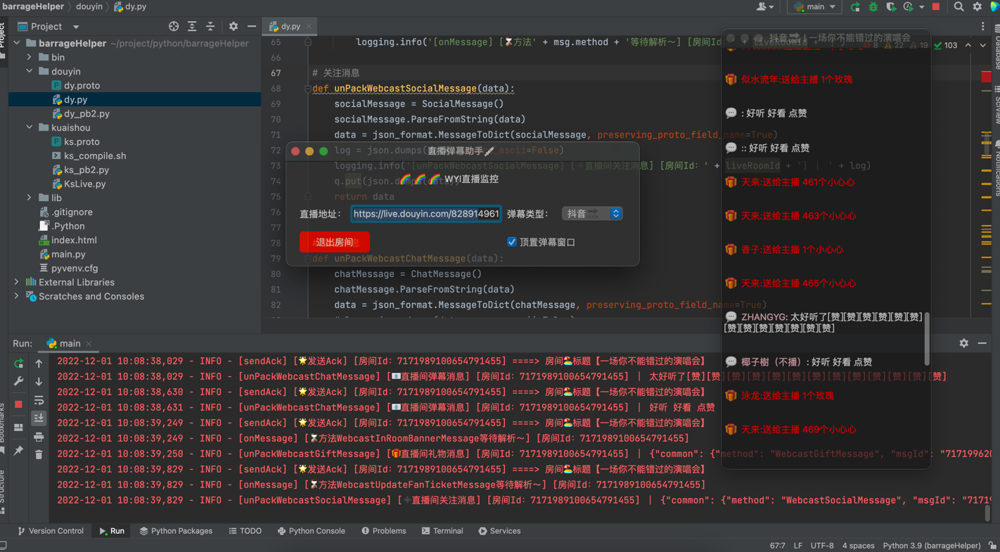

# 抖音网页版协议 👋

## [快手请移步👉](https://github.com/YunzhiYike/kuaishou-live)

## 🐂功能
- [X] 直播
- [ ] 短视频
- [ ] 待定.........

## ⛽️ 鼓励一下～
> 逆向是一个很枯燥的活，开源更不容易～～请动动您的小手给个`start`吧～

## [💰 自营代刷社区👈](http://www.kk123.ml)


## 💻 逆向技术
1. 谷歌浏览器 （抓包分析工具）
2. PyCharm  （编写代码）
3. protobuf （谷歌发明的一种通信协议）
4. Charles （抓包分析工具）

## ☕️ 轻松一下（作品展）
> 打个广告🪧～～ 需要直播监控的可以📮联系 `wuaiyiyun2022@163.com`
> 承接 Web、小程序、爬虫、网络代刷、建站、嵌入式、QQ 微信机器人开发等等 
> 擅长语言 `PHP` `Golang` `Python` `Java` `易语言`



## 使用说明📖
> 运行前请重新生成一下protobuf文件，因为机器系统不一样同时protobuf版本也不一样所以不能拿来直接用～
```shell

protoc -I . --python_out=. dy.proto

```

## 安装websocket依赖
```bash
pip install websocket
```

## 方法列表🚗
| 方法名称                | 类型       | 参数说明                                    | 说明        |
|---------------------|----------|-----------------------------------------|-----------|
| dy.parseLiveRoomUrl | `直播` | `url`：电脑网页版直播地址  | `启动抖音客户端` |


## 逆向视频教程
1. [【快手直播间弹幕采集协议分析第一课】](https://www.bilibili.com/video/BV1ZR4y1o7Ab/?share_source=copy_web&vd_source=71e28910aae780b1b2052c3052b8a2e8) 

> 本协议仅供学习参靠请勿非法用途，否则后果自负，与作者无关！

